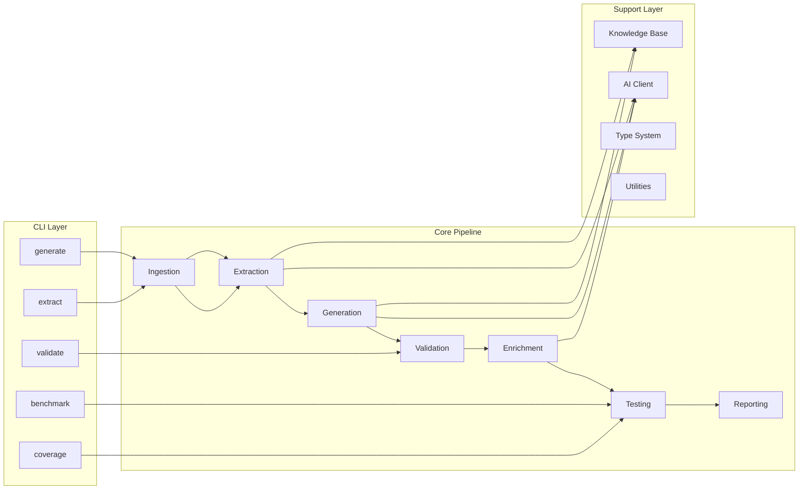
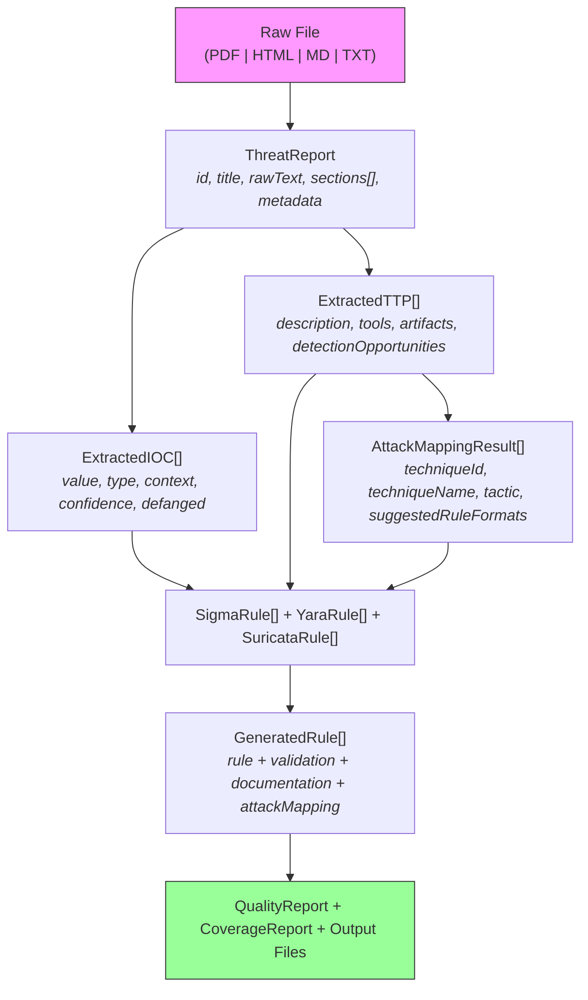
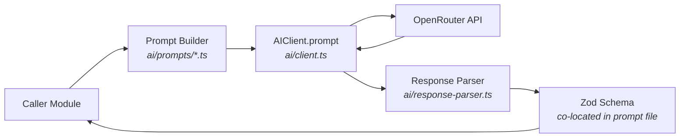
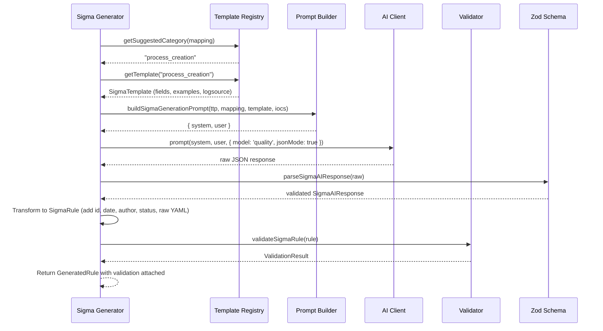
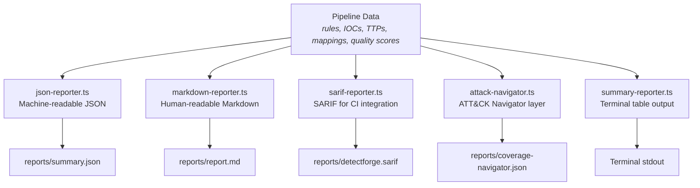

# DetectForge Technical Architecture

This document describes the internal architecture of DetectForge: data flow, module dependencies, type system, AI integration patterns, error handling, and testing strategy.

---

## Table of Contents

1. [System Overview](#system-overview)
2. [Data Flow](#data-flow)
3. [Module Dependency Graph](#module-dependency-graph)
4. [Type System](#type-system)
5. [AI Integration Layer](#ai-integration-layer)
6. [Generation Pipeline Detail](#generation-pipeline-detail)
7. [Validation Architecture](#validation-architecture)
8. [Knowledge Base Layer](#knowledge-base-layer)
9. [Testing Architecture](#testing-architecture)
10. [Error Handling Strategy](#error-handling-strategy)
11. [Configuration and Environment](#configuration-and-environment)
12. [Reporting Pipeline](#reporting-pipeline)

---

## System Overview

DetectForge is structured as a seven-stage pipeline with clear module boundaries. Each stage has a single responsibility, communicates through typed interfaces, and can be tested independently.



**Key architectural decisions:**

- **Pipeline, not monolith.** Each stage is independently importable and testable. The CLI commands orchestrate stage composition.
- **AI is infrastructure, not architecture.** The AI client is a utility layer. All AI interactions go through structured prompts with Zod-validated responses. No module depends on AI behavior -- every AI call has a typed contract.
- **Types drive everything.** The `src/types/` directory defines the canonical data structures. All modules communicate through these interfaces. No ad-hoc object shapes.
- **Validation is built-in, not bolted-on.** Every generated rule is validated immediately. Validation results are carried through the pipeline as first-class data.

---

## Data Flow

The core data transformation pipeline converts a raw report file into validated, documented detection rules:



### Data Transformation Summary

| Input | Process | Output |
|-------|---------|--------|
| `string \| Buffer` | Ingestion (parser + normalizer) | `ThreatReport` |
| `ThreatReport.rawText` | IOC Extractor (regex) | `ExtractedIOC[]` |
| `ThreatReport.rawText` | TTP Extractor (AI) | `ExtractedTTP[]` |
| `ExtractedTTP[]` | ATT&CK Mapper (AI + validation) | `AttackMappingResult[]` |
| `ExtractedTTP + AttackMappingResult + ExtractedIOC` | Sigma/YARA/Suricata Generator (AI) | `SigmaRule[] \| YaraRule[] \| SuricataRule[]` |
| `*Rule` | Validator (heuristic) | `ValidationResult` |
| `GeneratedRule` | Documentation Generator (AI) | `RuleDocumentation` |
| `GeneratedRule` | FP Analyzer (AI) | `FalsePositiveScenario[]` |
| `GeneratedRule[] + ExtractedTTP[] + AttackMappingResult[]` | Gap Analyzer (AI) | `GapAnalysisAIResponse` |
| `GeneratedRule[]` | Quality Scorer (heuristic) | `QualityReport` |
| `GeneratedRule[] + AttackMappingResult[]` | Coverage Metrics (heuristic) | `CoverageReport` |

---

## Module Dependency Graph

```mermaid
graph TD
    CLI["cli/commands/*"] --> ING["ingestion/"]
    CLI --> EXTR["extraction/"]
    CLI --> GEN["generation/"]
    CLI --> TEST["testing/"]
    CLI --> REP["reporting/"]

    ING --> PARSERS["ingestion/parsers/*"]
    ING --> NORM["ingestion/normalizer"]

    EXTR --> IOC["extraction/ioc-extractor"]
    EXTR --> TTP["extraction/ttp-extractor"]
    EXTR --> ATT["extraction/attack-mapper"]
    EXTR --> ENRICH["extraction/ioc-enrichment"]

    TTP --> AI["ai/client"]
    ATT --> AI
    TTP --> PROMPTS_TTP["ai/prompts/ttp-extraction"]
    ATT --> PROMPTS_ATT["ai/prompts/ttp-extraction"]

    GEN --> SIGMA_GEN["generation/sigma/generator"]
    GEN --> YARA_GEN["generation/yara/generator"]
    GEN --> SURI_GEN["generation/suricata/generator"]
    GEN --> DOC["generation/documentation"]
    GEN --> FPA["generation/false-positive-analyzer"]
    GEN --> GAP["generation/coverage-gap-analyzer"]

    SIGMA_GEN --> AI
    SIGMA_GEN --> PROMPTS_SIG["ai/prompts/sigma-generation"]
    SIGMA_GEN --> SIGMA_TPL["generation/sigma/templates"]
    SIGMA_GEN --> SIGMA_VAL["generation/sigma/validator"]

    YARA_GEN --> AI
    YARA_GEN --> PROMPTS_YAR["ai/prompts/yara-generation"]
    YARA_GEN --> YARA_TPL["generation/yara/templates"]
    YARA_GEN --> YARA_VAL["generation/yara/validator"]

    SURI_GEN --> AI
    SURI_GEN --> PROMPTS_SUR["ai/prompts/suricata-generation"]
    SURI_GEN --> SURI_TPL["generation/suricata/templates"]
    SURI_GEN --> SURI_VAL["generation/suricata/validator"]

    DOC --> AI
    DOC --> PROMPTS_DOC["ai/prompts/documentation"]
    FPA --> AI
    FPA --> PROMPTS_FP["ai/prompts/fp-analysis"]
    GAP --> AI
    GAP --> PROMPTS_GAP["ai/prompts/gap-analysis"]

    AI --> RP["ai/response-parser"]
    AI --> RETRY["ai/retry"]
    RP --> ZOD["zod"]

    IOC --> UTILS["utils/*"]
    ENRICH --> UTILS

    TEST --> QS["testing/quality-scorer"]
    TEST --> ST["testing/sigma-tester"]
    TEST --> CM["testing/coverage-metrics"]
    TEST --> FPE["testing/fp-evaluator"]
    TEST --> LG["testing/log-generator"]

    subgraph Types["types/ (shared interfaces)"]
        TR["ThreatReport"]
        EX["Extraction types"]
        DR["DetectionRule types"]
        MA["MITRE ATT&CK types"]
        CF["Config types"]
    end

    CLI --> Types
    EXTR --> Types
    GEN --> Types
    TEST --> Types
    REP --> Types
```



**Dependency principles:**

1. **Types are leaf nodes.** Nothing in `src/types/` imports from other `src/` modules. Every other module imports from types.
2. **AI client is stateless (per-request).** The `AIClient` class holds configuration and usage tracking, but each inference call is independent.
3. **Prompts are co-located with their schemas.** Each `ai/prompts/*.ts` file exports both the prompt builder and the Zod schema for validating the AI response. This keeps the contract between prompt and parser in one file.
4. **Generators delegate to templates and validators.** Each format's generator uses templates for prompt context and validators for post-generation checks. The generator never validates directly.
5. **Knowledge bases are read-only data.** The `knowledge/` modules load ATT&CK data, SigmaHQ references, and logsource catalogs. They provide lookup functions but never modify data.

---

## Type System

The type system is built around five core interfaces that flow through the pipeline:

### `ThreatReport` -- The Input

```typescript
interface ThreatReport {
  id: string;                    // UUID generated at parse time
  title: string;                 // Extracted from document metadata or heading
  source: string;                // Filename or URL
  date: string;                  // ISO date string
  rawText: string;               // Full normalized text for extraction
  sections: ReportSection[];     // Classified sections (overview, TTPs, IOCs, etc.)
  metadata: ReportMetadata;      // Threat actor, campaign, targets, malware families
  inputFormat: InputFormat;      // pdf | html | markdown | plaintext | stix | json
}
```

### `ExtractedIOC` / `ExtractedTTP` -- The Extraction Layer

```typescript
interface ExtractedIOC {
  value: string;                 // Refanged value (e.g., "192.0.2.1")
  type: IOCType;                 // 12 types: ipv4, domain, sha256, registry_key, etc.
  context: string;               // Surrounding text from report
  confidence: 'high' | 'medium' | 'low';
  defanged: boolean;             // Whether original was defanged
  originalValue: string;         // Exact string from report
  relationships: IOCRelationship[];
}

interface ExtractedTTP {
  description: string;           // 30-80 word behavioral description
  tools: string[];               // e.g., ["Mimikatz", "PsExec"]
  targetPlatforms: string[];     // e.g., ["Windows"]
  artifacts: TTTArtifact[];      // file, registry, event_log, network, process
  detectionOpportunities: string[];
  confidence: 'high' | 'medium' | 'low';
}
```

### `AttackMappingResult` -- The Bridge

The ATT&CK mapping result connects extraction to generation. It carries the technique ID, tactic, confidence, reasoning, and critically, `suggestedRuleFormats` -- which tells the generation layer whether to create Sigma, YARA, Suricata rules, or some combination:

```typescript
interface AttackMappingResult {
  techniqueId: string;           // e.g., "T1059.001"
  techniqueName: string;         // e.g., "PowerShell"
  tactic: string;                // e.g., "Execution"
  confidence: 'high' | 'medium' | 'low';
  reasoning: string;             // Why this mapping was chosen
  sourceTtp: ExtractedTTP;       // Back-reference to source TTP
  suggestedRuleFormats: ('sigma' | 'yara' | 'suricata')[];
  validated: boolean;            // Cross-referenced against ATT&CK dataset
}
```

### `GeneratedRule` -- The Core Output

```typescript
interface GeneratedRule {
  format: 'sigma' | 'yara' | 'suricata';
  sigma?: SigmaRule;             // Populated when format is 'sigma'
  yara?: YaraRule;               // Populated when format is 'yara'
  suricata?: SuricataRule;       // Populated when format is 'suricata'
  sourceReportId: string;
  sourceTtp?: string;
  attackTechniqueId?: string;
  attackTactic?: string;
  confidence: 'high' | 'medium' | 'low';
  documentation?: RuleDocumentation;
  validation: ValidationResult;  // Always populated -- validation is mandatory
}
```

### `ValidationResult` -- Carried Through the Pipeline

```typescript
interface ValidationResult {
  valid: boolean;
  syntaxValid: boolean;
  schemaValid: boolean;
  errors: string[];
  warnings: string[];
}
```

Every `GeneratedRule` carries its `ValidationResult`. This means downstream consumers (quality scorer, reporters) always know whether a rule passed validation without re-running it.

---

## AI Integration Layer

### Architecture



### Three-Tier Model Selection

The AI client supports three model tiers, selectable per operation:

| Tier | Cost | Latency | Use Cases |
|------|------|---------|-----------|
| **fast** | ~$0.10/M input | Low | IOC extraction, classification, disambiguation |
| **standard** | ~$0.80/M input | Medium | TTP extraction, ATT&CK mapping, general tasks |
| **quality** | ~$3.00/M input | Higher | Rule generation, documentation, complex reasoning |

The tier is not hardcoded per operation. The `generate` command defaults to `standard` but accepts `--model fast|standard|quality` to override for the entire run. Within the pipeline, certain operations naturally benefit from higher tiers (rule generation) while others work well with fast models (IOC regex disambiguation).

### Request Lifecycle

1. **Prompt construction.** The prompt builder in `ai/prompts/*.ts` constructs a system prompt (persona + specification + examples + output format) and a user prompt (specific data to process).
2. **Inference call.** `AIClient.prompt()` sends the messages to OpenRouter with the selected model, temperature (default 0.1 for deterministic output), and optional JSON mode.
3. **Cost tracking.** Every call logs input tokens, output tokens, cost estimate, duration, and model ID to the usage log.
4. **Response parsing.** `extractJsonFromResponse()` handles markdown code blocks, finds JSON boundaries, and repairs common issues (trailing commas, unclosed brackets).
5. **Zod validation.** The parsed JSON is validated against the operation-specific Zod schema. If validation fails, the error includes the schema path, message, and raw response excerpt for debugging.
6. **Retry on transient failures.** The `withRetry()` wrapper handles 429 (rate limit), 5xx (server errors), and network failures with exponential backoff and jitter.

### JSON Repair Strategy

AI models occasionally produce malformed JSON. The response parser implements a three-tier repair strategy:

1. **Direct parse.** Try `JSON.parse()` on the cleaned response.
2. **Standard repair.** Remove trailing commas, count bracket nesting, append missing closers in correct order.
3. **Aggressive repair.** Count unmatched openers/closers, insert missing brackets before the last closing brace (handles the common case of an unclosed array inside an object).

---

## Generation Pipeline Detail

### Template-Driven Generation

Each rule format uses a template system that constrains what the AI can generate:

**Sigma Templates** (`generation/sigma/templates.ts`):
- 10+ logsource categories: `process_creation`, `network_connection`, `dns_query`, `file_event`, `registry_event`, `image_load`, etc.
- Each template defines: logsource block, available fields (the AI can only use these), common false positives, and an example detection block
- `getSuggestedCategory()` maps ATT&CK tactics/techniques to appropriate logsource categories

**YARA Templates** (`generation/yara/templates.ts`):
- Categories: PE executable, ELF, script/document, web shell, etc.
- Each template defines: magic bytes, common strings, condition skeleton, and file type constraints

**Suricata Templates** (`generation/suricata/templates.ts`):
- Categories: HTTP C2, DNS tunneling, TLS fingerprint, etc.
- Each template defines: protocol, default source/destination, direction, required keywords, and classtype

### Generation Flow (Sigma Example)



---

## Validation Architecture

Validation is format-specific and happens immediately after generation. Each validator checks both syntax and schema compliance:

### Sigma Validator
- YAML parseable
- Required fields present: `title`, `description`, `logsource` (with `product`), `detection` (with `condition`), `level`
- Valid `status` value (experimental, test, stable, deprecated, unsupported)
- Valid `level` value (informational, low, medium, high, critical)
- Tags follow ATT&CK naming conventions
- Detection condition references valid selection names

### YARA Validator
- Rule structure: `rule Name { meta: strings: condition: }`
- String identifiers start with `$` followed by valid identifier characters
- Hex strings contain only valid hex characters (0-9, A-F, spaces, ??, [], (), |)
- Condition is non-empty and references defined strings
- Meta section has required fields (description, author, date)

### Suricata Validator
- Rule header format: `action protocol src_ip src_port direction dest_ip dest_port (options;)`
- Required keywords present: `msg`, `sid`, `rev`
- Content strings properly quoted
- SID in valid range (9000000-9999999 for DetectForge-generated rules)
- Flow directive present for TCP protocols

---

## Knowledge Base Layer

The `src/knowledge/` modules provide static reference data:

### MITRE ATT&CK (`knowledge/mitre-attack/`)
- **Loader:** Parses ATT&CK Enterprise JSON (STIX format) into typed `AttackTechnique`, `AttackTactic`, and `AttackDataSource` objects
- **Techniques:** Lookup by ID, parent/subtechnique navigation, tactic filtering
- **Data Sources:** Maps data source components to detectable techniques

### SigmaHQ Reference (`knowledge/sigma-reference/`)
- **Loader:** Parses SigmaHQ rule corpus for reference comparison
- **Quality Scorer:** Compares generated rules against community-written rules for the same technique

### Logsource Catalog (`knowledge/logsource-catalog/`)
- **Windows:** Windows Event Log channels, Sysmon event types, Security event IDs
- **Linux:** Auditd, syslog, systemd journal categories
- **Sysmon:** Sysmon-specific event types (1-26) with field mappings

---

## Testing Architecture

### Test Organization

```
tests/
  unit/
    ai/                  # Prompt construction, response parsing, retry logic
    cli/                 # Command registration, option parsing
    extraction/          # IOC regex patterns, enrichment, deduplication
    generation/
      sigma/             # Sigma templates, prompts, validators
      yara/              # YARA templates, prompts, validators
      suricata/          # Suricata templates, prompts, validators
      documentation/     # Documentation prompt + generator
      fp-analysis/       # FP analysis prompt + analyzer
      gap-analysis/      # Gap analysis prompt + analyzer
    ingestion/           # Parser and normalizer tests
    knowledge/           # ATT&CK loader, logsource catalog, SigmaHQ reference
    reporting/           # JSON, Markdown, SARIF, Navigator, summary reporters
    testing/             # Quality scorer, sigma tester, FP evaluator, coverage metrics
    utils/               # Defang, hash, network utilities
    validation/          # Cross-format validation tests
  integration/
    full-pipeline.test.ts  # End-to-end pipeline test (mocked AI)
  benchmark/             # Performance benchmarks
```

### Testing Principles

1. **No network calls in unit tests.** All AI interactions are mocked. Tests validate prompt construction, response parsing, and Zod schema enforcement without hitting the API.
2. **Every module has its own test file.** The test directory structure mirrors `src/`. Finding the test for any module is deterministic.
3. **Validation tests use real rule content.** Validator tests use actual Sigma YAML, YARA rule text, and Suricata rule strings to test edge cases.
4. **Prompt tests verify structure, not content.** Prompt builder tests check that the output contains required sections, references the correct fields, and includes the schema description. They do not assert on specific wording.

### Test Configuration

```typescript
// vitest.config.ts
export default defineConfig({
  test: {
    globals: true,
    environment: 'node',
    include: ['tests/**/*.test.ts'],
    coverage: {
      provider: 'v8',
      thresholds: {
        global: { branches: 80, functions: 80, lines: 80, statements: 80 },
      },
    },
    testTimeout: 30000,
  },
  resolve: {
    alias: { '@': resolve(__dirname, 'src') },
  },
});
```

---

## Error Handling Strategy

### Layered Error Handling

1. **Utility level:** Functions in `utils/` throw specific errors with descriptive messages. They do not catch or retry.
2. **AI level:** The AI client throws on HTTP errors. The `withRetry()` wrapper catches retryable errors (429, 5xx, network) and retries with backoff. Non-retryable errors propagate.
3. **Response parsing level:** Zod validation errors are caught and re-thrown with formatted details (schema path, message, raw response excerpt).
4. **Module level:** Extraction and generation modules let errors propagate. They do not swallow failures.
5. **CLI level:** The command handlers catch all errors. Each pipeline stage runs in a try/catch with a spinner. Failures show a user-friendly error message with chalk styling and exit code 1.

### Graceful Degradation in Generate

The `generate` command demonstrates graceful degradation. If YARA generation fails but Sigma succeeds, the command continues, prints a warning, and outputs the Sigma rules it did generate. The pipeline is not all-or-nothing for rule formats:

```typescript
// Sigma generation failure: print warning, continue to YARA
} catch (err) {
  sigmaSpinner.fail(chalk.red('Sigma rule generation failed'));
  printWarning(`Sigma generation error: ${err.message}`);
}
```

Optional stages (documentation, FP analysis, coverage gaps, testing) also fail gracefully. They enhance the output but do not block it.

### AI Retry Policy

```typescript
const DEFAULT_OPTIONS = {
  maxRetries: 3,
  initialDelayMs: 1000,
  maxDelayMs: 30000,
  backoffMultiplier: 2,
  retryableErrors: [429, 500, 502, 503, 504],
};
```

Jitter is applied (0.5x-1.5x) to prevent thundering herd on rate limit recovery. The retry handler also parses `Retry-After` headers from 429 responses and respects the requested delay.

---

## Configuration and Environment

### Environment Variables

| Variable | Required | Default | Description |
|----------|----------|---------|-------------|
| `OPENROUTER_API_KEY` | Yes | -- | OpenRouter API key for AI inference |
| `OPENROUTER_MODEL_FAST` | No | `google/gemini-2.0-flash-001` | Fast tier model identifier |
| `OPENROUTER_MODEL_STANDARD` | No | `anthropic/claude-3.5-haiku` | Standard tier model identifier |
| `OPENROUTER_MODEL_QUALITY` | No | `anthropic/claude-sonnet-4` | Quality tier model identifier |
| `ANTHROPIC_API_KEY` | No | -- | Direct Anthropic API key (alternative) |
| `LOG_LEVEL` | No | `info` | Logging verbosity: debug, info, warn, error |
| `TRACK_API_COSTS` | No | `true` | Enable per-call cost tracking |

### TypeScript Configuration

- **Target:** ES2022 (top-level await, structuredClone, etc.)
- **Module:** ESNext with bundler resolution (Bun native)
- **Strict mode:** Enabled with `noUnusedLocals`, `noUnusedParameters`, `noFallthroughCasesInSwitch`
- **Path aliases:** `@/*` maps to `./src/*` for clean imports
- **Source maps:** Enabled for debugging with declaration maps for type exports

---

## Reporting Pipeline

The reporting module produces multiple output formats from the same pipeline data:



### SARIF Integration

The SARIF reporter enables GitHub Advanced Security integration. Each generated rule becomes a SARIF "result" with:
- Rule ID mapped to ATT&CK technique
- Message describing what the rule detects
- Level mapped from Sigma severity levels
- Location referencing the source threat report

This allows DetectForge output to appear in GitHub's Security tab and code scanning alerts.

### ATT&CK Navigator Layer

The Navigator layer export produces a JSON file compatible with MITRE's ATT&CK Navigator web tool. Each covered technique gets a color-coded score based on detection confidence. This provides an immediate visual of coverage gaps overlaid on the full ATT&CK matrix.
